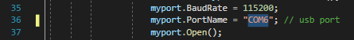

# Fitness-Snake

Hello and welcome to our version of Snake which includes a fitness tracker. You can play this game while doing your cardio.

If you are hooked up to a heartrate sensor your heartrate will be reflected in the game. It will tell you your current heartrate and heartrate percentage so you can aim for the most optimal heartrate for your training.

Another important thing about our Snake game is that any food you eat in the game will only count to your score if your heartrate is being tracked.

Information on how to setup the game and sensor is below.

### Game files

First off download our game with the green download button above. Download as ZIP and unpack it in a location of your choice. (You only need the "Game" folder, ignore README.md and Images)

To unzip the file you will a program like [Winrar](https://www.rarlab.com/download.htm). "WinRAR x64 (64 bit)" is recommended.

### Arduino & Pulse Sensor

To run our version of the snake game, you will need an [Arduino UNO](https://store.arduino.cc/arduino-uno-rev3) and a [pulse sensor](https://learn.sparkfun.com/tutorials/sparkfun-pulse-oximeter-and-heart-rate-monitor-hookup-guide).

#### Firstly you need to hook up the sensor to the Arduino

You'll need 6 male-male jumper cables and plug the cables into these ports on the Arduino & sensor. Connect it like the following picture. 

#### Arduino IDE

Once you have connected the sensor to the Arduino, you will also need the [Arduino IDE](https://www.arduino.cc/download_handler.php) software to upload the Arduino script to the Arduino.

Plug in the Arduino to your computer using the USB cable.

To upload the script to your Arduino, open the ArduinoSettings.ino file (Game\ArduinoSettings\ArduinoSettings.ino).
Click on Sketch and on Upload. Wait a moment for the script to upload, you can see the progress in the bottom of the Arduino IDE.

One thing you need to remember for later is which USB port you have plugged your Arduino into. If you click on Tools and hover over Port, you can see to which port the Arduino is connected to.

[More detailed explanation](https://github.com/aliekens/pulse_sensor_tutorial)

### Visual Studio

To run our project you will need [Visual Studio](https://visualstudio.microsoft.com/downloads/).

Proceed through the installer until the program is completely installed.

#### Setup of the game

The game needs to know which USB port your Arduino is connected to. In the Program.cs file (Game\SnakeApp\SnakeApp\Program.cs) you need to change which COM port you are using. On line 36 change the text between the quotation mark's to whichever COM port you had.

You can make changes to the game settings in the Settings.cs file (Game\SnakeApp\SnakeApp\Settings.cs). You can change the width and height of the game, the speed of the snake, the starting score and the number of points you get per food.

Don't forget to save the Program.cs and Settings.cs files if you made any changes.

#### Startup of the game

To lauch the game navigate to SnakeApp.sln (Game\SnakeApp\SnakeApp.sln). 

Launch the game with Visual studio. In the toolbar click on Start.

### Play

Once the game launches get ready because it will start quickly. Hold the sensor in your spare hand and aim the sensor at the fingerprint side of your index finger. Do not press to hard, but also hold the sensor firmly. The game will tell you if the sensor is working properly.

Use the arrow keys on your keyboard to control the snake.
